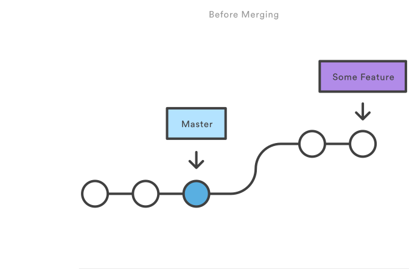
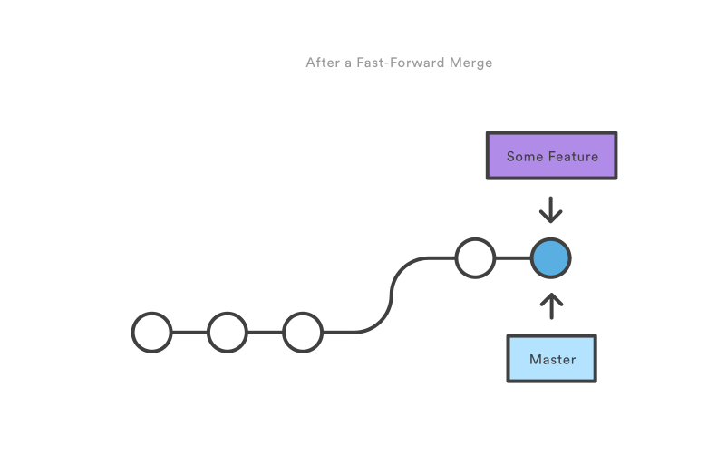
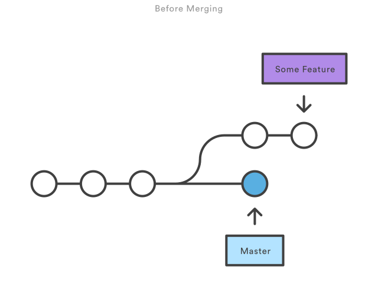

# git and github

Niall O'Gorman


---
Version control solutions


---


---

```
git push
```

simple, elegant, powerful

---

## so what is git? and how do we use it?
 
---


 
+++

- distributed version control system

- optimized for performance |

- security - cryptography to store all objects in git repository |

- open source, standard |


+++

-diagram

---


+++

- git hosting service with web based gui

- access control |

- collaboration platform |

- 3rd party integration |

---

How to use git

+++

command line

+++

IDE integration

---

## workflows
* getting started
* version control
* branches
* delivery
* undoing

---

## workflows
* `getting started`
* version control
* branches
* delivery
* undoing

---

- create new repo on github

+++


+++

```
git clone
```
copy the repository to local working directory
---

## workflows
* getting started
* `version control`
* branches
* delivery
* undoing

+++


+++

```
git add
```
stage changes for next commit
**useful when making lots of change and reviewings**

+++

```
git commit
```
commit staged snapshot (with message) to project history

**commiting changes are always to local repository**

+++

### tips

* use `git stash` and `git stash pop` to temporarily safe changes

* create `.gitignore` file to specify files which are not part of project

---
## workflows
* getting started
* version control
* `branches`
* delivery
* undoing

+++


+++

Master branch - *production ready, dont develop in master*

Big feature branch - used to implement an application features, multiple commits

little feature - used to fix bug, few commits

+++

```
git checkout <branch>
git checkout -b <new branch>

```
navigate between branches

+++

```
git merge <branch>

```
pull changes in branches together

+++

merge type #1  ___**fast forward merge**___

- instead of "merging" git can move the head of the branch to target

+++



+++



+++

merge type #2  ___**3-way merge**___

- fast forward not possible if branches have diverged
- git uses common ansestor and will auto merge or flag any conflicts 

+++



+++


+++

---
## workflows
- getting started
- version control
- branches
- `delivery`
- undoing

+++

```
git pull 

```
fetch remote copy and merge into local

+++

```
git push

```
transfer local commits to remote

+++

+++

### tips

when on master branch

* `git pull` ==  `git pull origin`

* `git push` == `git push origin master`


---
## workflows
- getting started
- version control
- branches
- delivery
- `undoing`

+++

fixing stuff
- git checkout - checkout a branch, a file or a commit
- git revert - add a new commit to undo a commit
- git reset - only for local changes! permenant undo, no way to retrieve original 
