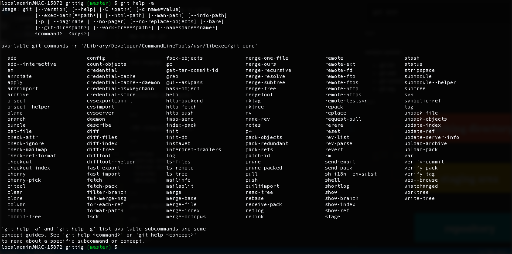

---

```
git push
```

simple, elegant, powerful

---


---

so what is git? and how do we use it?
 
---


 
+++

distributed version control system

+++

-diagram

+++

optimized for performance

+++

-diagram

+++

security - all objects in git repository cryptograpic 

+++

-diagram

+++

open source, standard


+++

-diagram

---


+++

git hosting service with web based gui

+++

-diagram

+++

access control

+++

collaboration

+++

3rd party integration

---

gitlab - an alternate to github 

---

How to use git

+++




+++

-IDE integration diagram

---

workflows
- getting started
- version control
- branches
- delivery

---

getting started

- create new repo on github
```
git clone
```

+++


+++

**live coding!**

---

version control

- git add
- git commit

+++


+++

**live coding!**

---

branches
- git checkout 
- git merge
- git rebase

+++

master - *production ready, dont develop in master*

+++

diagram - master

+++

feature branch - multiple commits
fix branch - few commits

+++

diagram - master with branch

+++

features and fixes get merged into master

+++

diagram - merge branch (merge head of each branch)

+++

diagram - multiple branches, rebase (rollback and apply changes)

---

delivery
- git fetch
- git pull
- git push
- .gitignore
---

fixing stuff
- rollback
- retrieve branch from remove
- delete entire local
