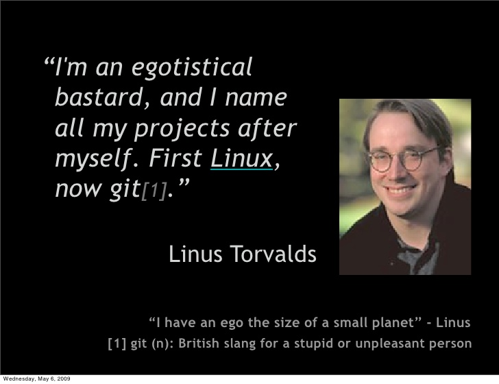

# git and github

Niall O'Gorman


---


### who has used SCLM for source control?


---

### or perhaps one of these?


 


---


---


### In 2005 this guy had a source control problem


---

### so he started building his own


---

### meanwhile in San Fransisco 2007, some open source develoers had their idea...


---

### all this grew into todays global open source ecosystem 

- 117K businesses 

- 61M repositories 

- 22M developers 

https://octoverse.github.com/

---

### supporting all these technologies and many more


---


```
git push
```

simple, elegant, powerful

+++


---

### go on then, tell me about git...


 
+++



+++

- distributed version control system - each developer has full history locally

- non linear workflows - branches are cheap, rapid branching and merging <!-- .element: class="fragment" -->
 
- optimized for performance - efficient for large projects <!-- .element: class="fragment" -->

- data integrity - cryptographic authentication of objects in git repository (commit hash) <!-- .element: class="fragment" -->

- toolkit design - designed to support frontends, open source, chain components <!-- .element: class="fragment" -->

---

### and github ? 


+++

- git hosting service with web based gui

- access control - code security <!-- .element: class="fragment" -->

- project management - commit history, bug tracking, issues management <!-- .element: class="fragment" -->

- open source collaboration - fork & pull requests <!-- .element: class="fragment" -->

- social media-like features  - feeds, wikis, email notifiation  <!-- .element: class="fragment" -->

- 3rd party integration - Jenkins, Pivotal tracker etc <!-- .element: class="fragment" -->

---

### Ways to use git

+++

command line

+++

IDE integration

---

## workflows
* getting started
* version control
* branches
* delivery
* undoing

---

## workflows
* getting started <!-- .element: style="background-color:powderblue;" -->
* version control
* branches
* delivery
* undoing

+++

- create new repo on github

+++


+++

```
git clone
```
copy the repository to local working directory


+++

```
git status
```
speaks for itself -  **most frequently used command**

+++

```
git log
```
view change history 

---

## workflows
* getting started
* version control <!-- .element: style="background-color:powderblue;" -->
* branches
* delivery
* undoing

+++


+++

```
git add
```
- stage changes for next commit 

- **useful when making lots of change and reviewing**

+++

```
git commit
```

- commit staged snapshot (with message) to project history

- **commiting changes are always to local repository**

+++

### tips

* use `git stash` and `git stash pop` to temporarily save changes

* create `.gitignore` file to specify files which are not part of project

---
## workflows
* getting started
* version control
* branches <!-- .element: style="background-color:powderblue;" -->
* delivery
* undoing

+++


+++

master branch - *production ready, do not develop in master*

big feature - used to implement an application features, multiple commits

little feature - minor changes, used to fix bugs, few commits

+++

```
git checkout <branch>
git checkout -b <new branch>

```
navigate between branches

+++

```
git merge <branch>

```
pull changes in branches together

+++

merge type #1  - ___**fast forward merge**___

+++


+++


- instead of "merging" git can move the head of the branch to target

+++

merge type #2 - ___**3-way merge**___

+++


- branches have diverged so fast forward not possible

+++


- git algorithm uses common ancestor and will auto merge or flag any conflicts

---
## workflows
- getting started
- version control
- branches
- delivery <!-- .element: style="background-color:powderblue;" -->
- undoing

+++

```
git pull 

```
fetch remote copy and merge into local

+++

```
git push

```
transfer local commits to remote

---
## workflows
- getting started
- version control
- branches
- delivery
- undoing <!-- .element: style="background-color:powderblue;" -->

+++

when you need to fix stuff

+++

```
git checkout
```

checkout a branch, a file or a commit

+++


```
git revert
```

add a new commit to undo a commit

+++

```
git reset
```

use only for local changes! permanent undo, no way to retrieve original

+++

```
rm -rf
git clone
```

the **nuclear** option, blow everything away and restore local repository from remote

---

questions?

---


---

- https://github.allstate.com/
- https://octoverse.github.com/
- https://www.atlassian.com/git/tutorials/
- http://www.drdobbs.com/tools/three-way-merging-a-look-under-the-hood/240164902


